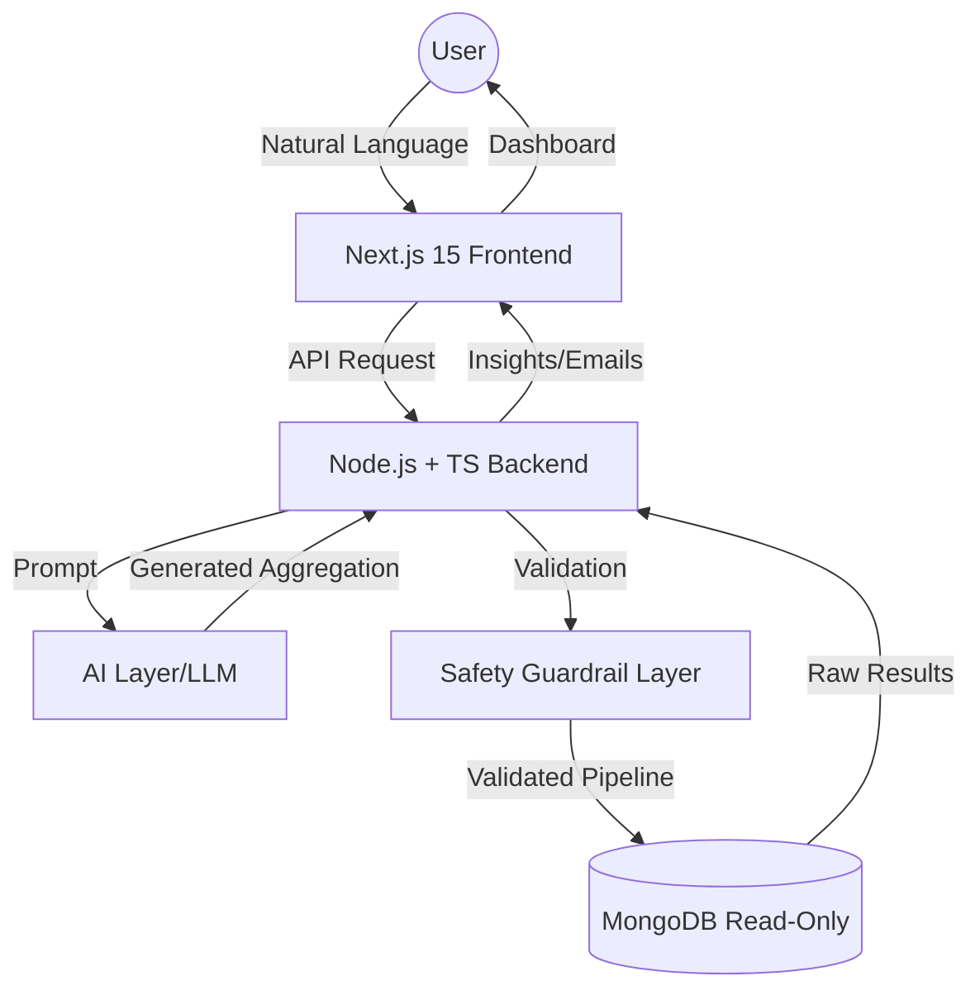

# Learn: QueryCraft AI

## 1. Problem Understanding
Modern CRMs are goldmines of data, but extracting actionable insights often requires:
- Deep knowledge of MongoDB aggregation syntax.
- Technical expertise to write complex queries.
- Manual effort to transform raw data into sales strategies.

**QueryCraft AI** bridges this gap by allowing non-technical users to query their CRM using natural language.

## 2. High-Level Architecture
QueryCraft AI follows a modern MERN + TypeScript architecture with an AI intelligence layer.

## 3. The Danger of Aggregation Pipelines
MongoDB aggregation pipelines are powerful but risky if exposed directly to AI:
- **Destructive Operators**: While aggregations are generally for reading, certain stages or misconfigurations could lead to performance degradation (DDOS-like behavior).
- **Infinite Loops/Heavy Computations**: A poorly written `$lookup` or `$graphLookup` can crash a database instance by consuming all RAM/CPU.
- **Data Leakage**: Without proper `$match` filters, users might access data they aren't authorized to see.

## 4. How Safety Validation Works
QueryCraft AI implements a strict multi-stage safety layer:
1. **Operator Whitelist**: Only safe operators like `$match`, `$group`, `$project`, `$sort`, and `$limit` are allowed.
2. **Mandatory `$limit`**: Every query is forced to have a maximum result size to prevent memory overflow.
3. **Pipeline Depth**: Pipelines exceeding a certain number of stages are rejected.
4. **Schema Enforcement**: Ensuring the AI only queries known collections and fields.

## 5. Why Read-Only DB Access is Mandatory
Even with validation, the database connection used by the AI service must be restricted at the infrastructure level:
- **Zero Mutation**: The database user has no `insert`, `update`, or `delete` permissions.
- **Blast Radius**: If the AI is somehow tricked into generating a malicious query, it cannot alter or destroy production data.
- **Compliance**: Ensures that QueryCraft AI remains a pure "intelligence" system rather than a "data management" system.
